# 🧠 YOLO Object & Face Detection — Summary Report

This project evaluates modern YOLO detectors (v8, v11, v12), fine-tunes YOLOv8 for face detection, compares it with an optimized YOLOv8-Face model, and trains a YOLOv1-style face detector from scratch.

The README highlights **results visually** using your provided images.

---

# 🚀 1. Object Detection (YOLOv8 vs YOLOv11 vs YOLOv12)

## Cup Video – Detection Examples
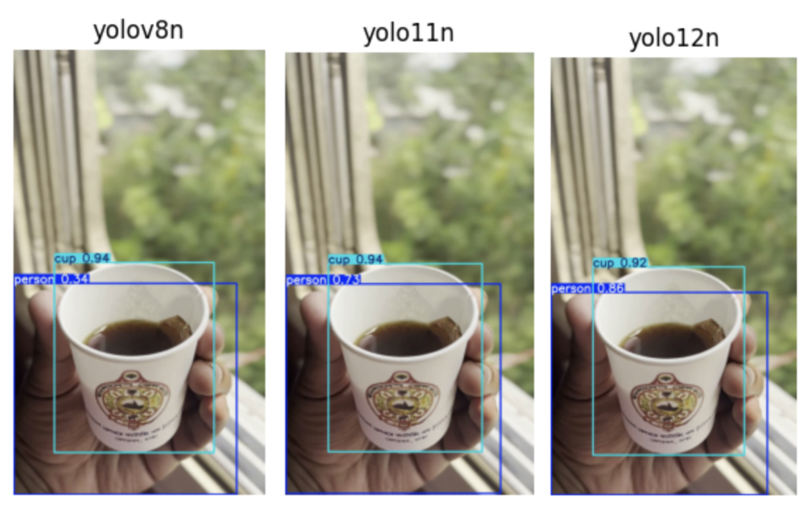

## Cat Video – Detection Examples
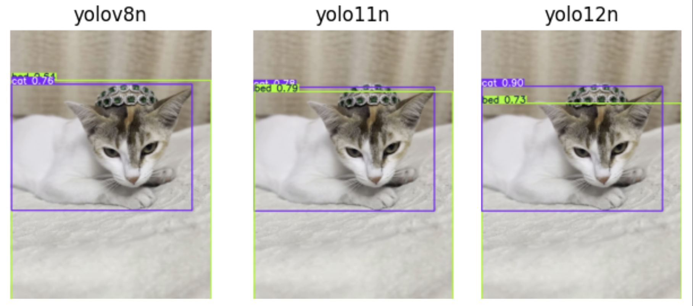
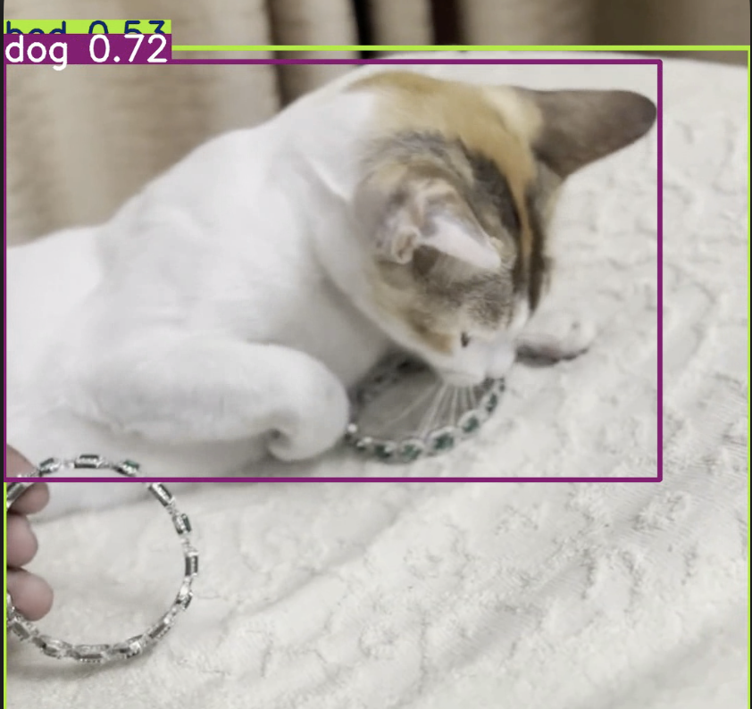
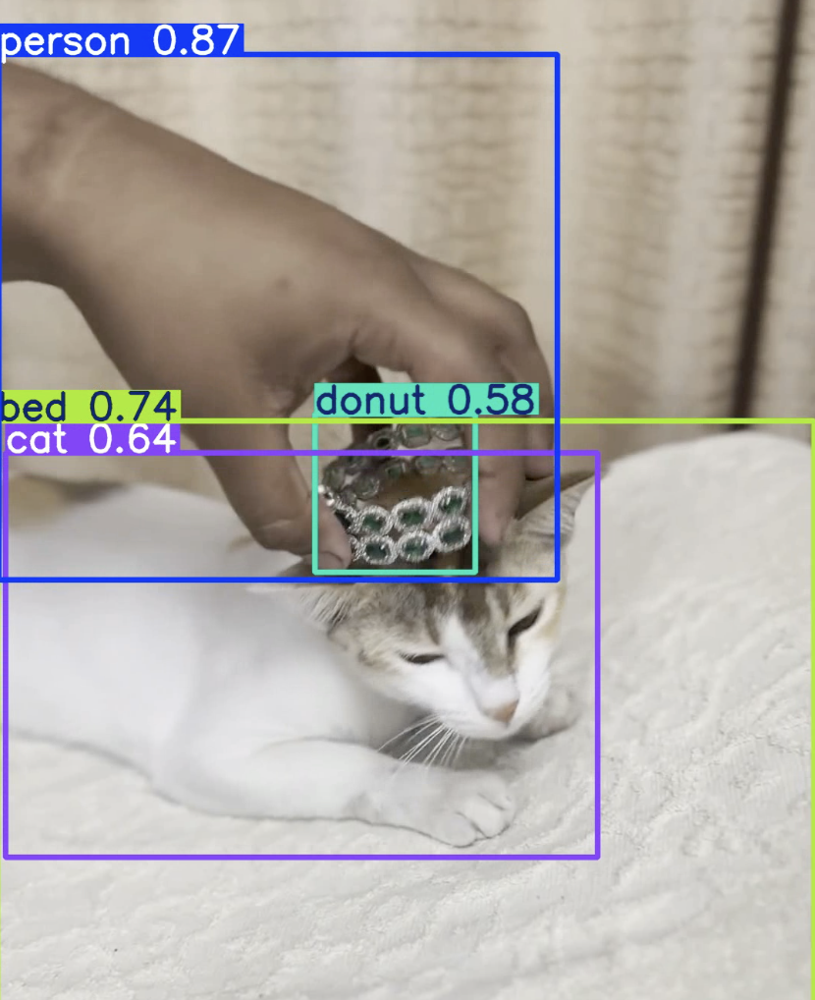

**Summary**
- **YOLOv8** → Fastest (~200 FPS)  
- **YOLOv11 / YOLOv12** → Better localization & consistency  
- Occasional COCO-based misclassifications (cat → dog, bangle → donut)

---

# 👤 2. Fine-Tuning YOLOv8 for Face Detection (WIDER FACE)

Below are outputs from the fine-tuned YOLOv8 face detector:

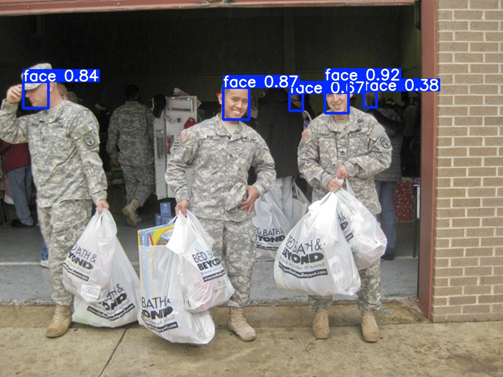
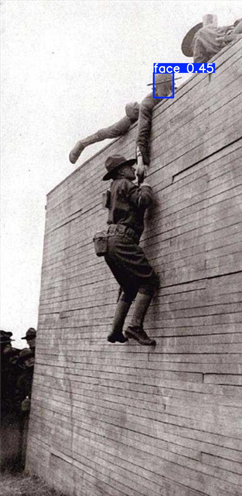
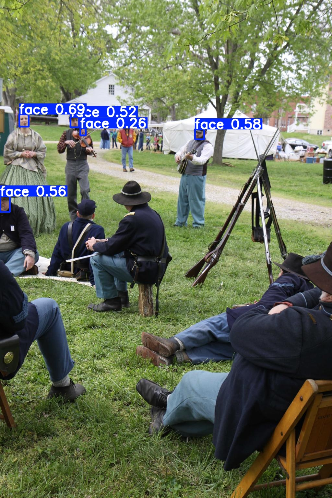

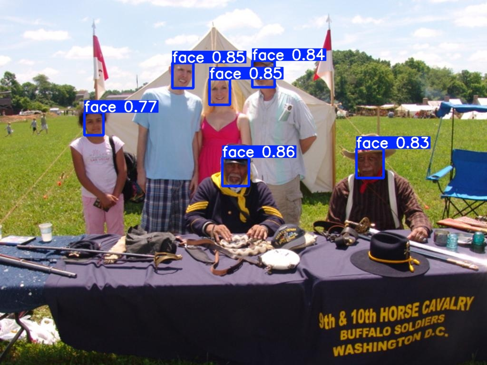
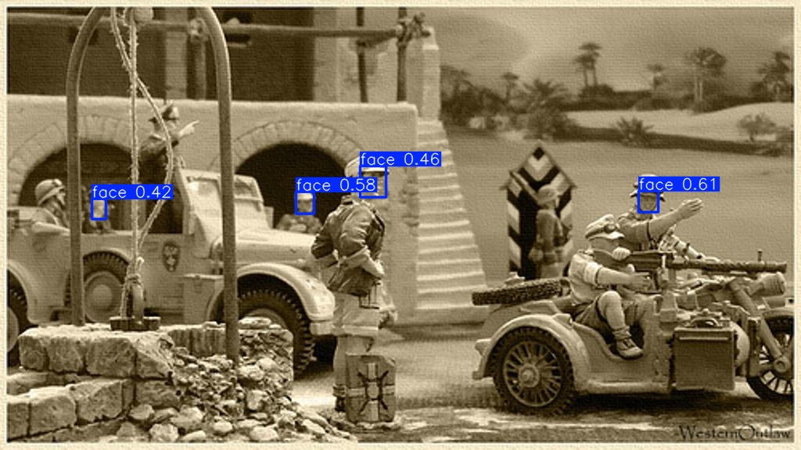

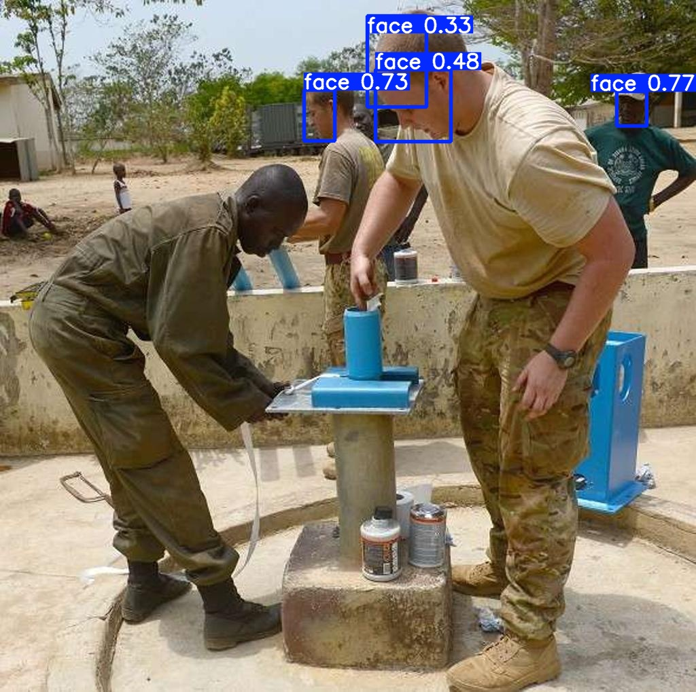

**Summary:**  
- Detects frontal faces with high confidence  
- Misses tiny, angled, or heavily occluded faces  

---

# ⚔️ 3. YOLOv8 (Fine-Tuned) vs Yusepp’s YOLOv8-Face

### Side-by-Side Comparison
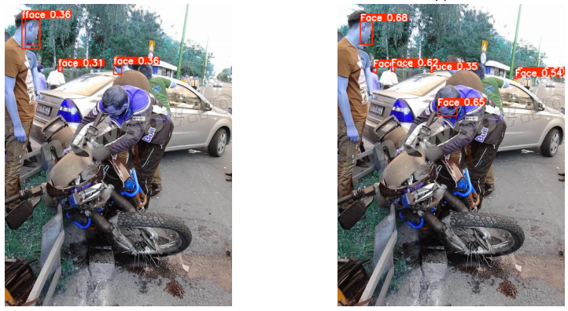
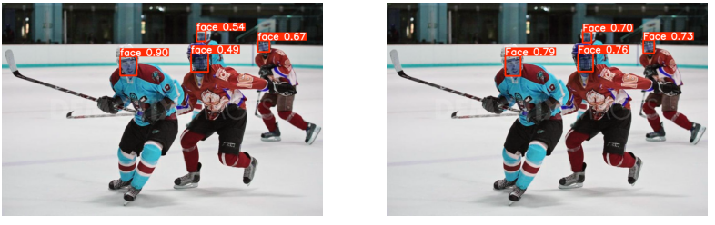
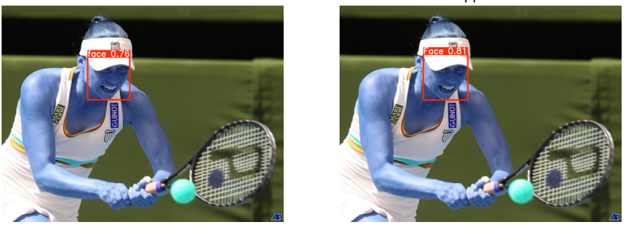

**Summary:**  
- **Yusepp’s YOLOv8-Face** outperforms in crowded & small-face scenarios  
- Better precision, recall, and mAP  
- Our fine-tuned YOLOv8 still performs strongly on clear frontal faces  

---

# 🟧 4. YOLOv1-Style Face Detector (Trained From Scratch)

## Validation Examples
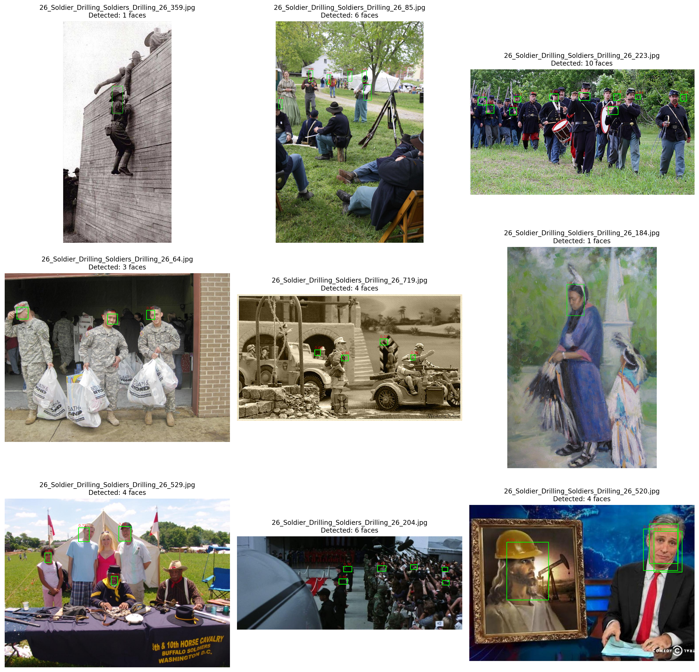

## Training Curves
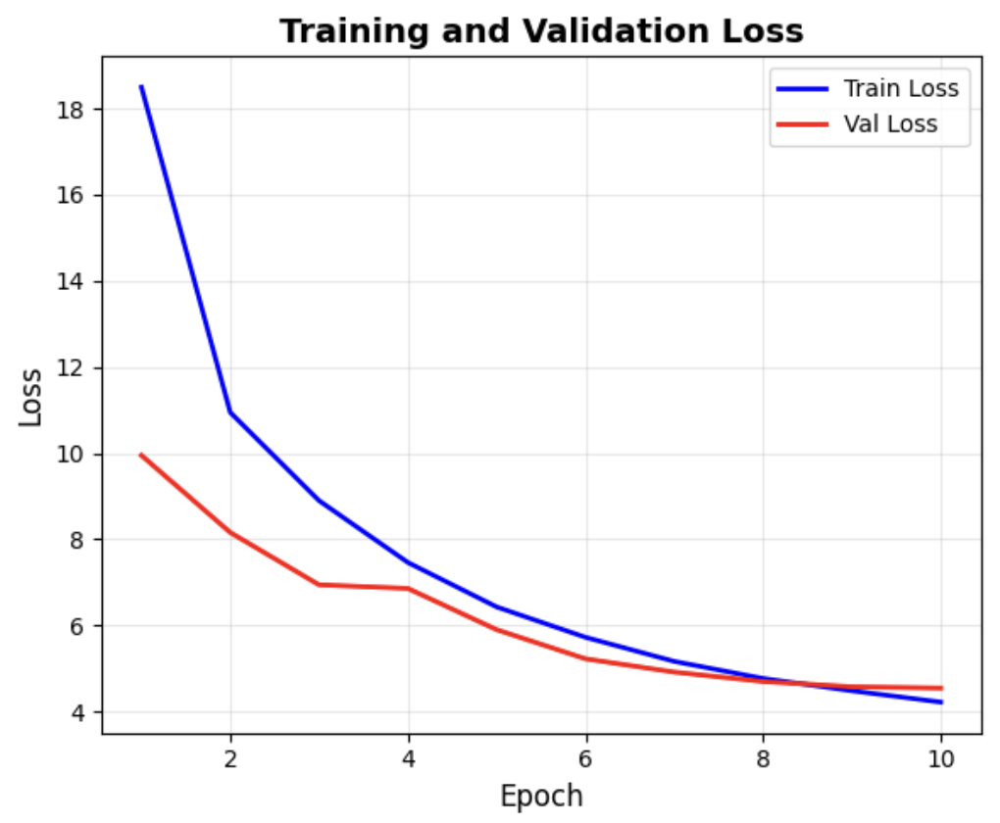

**Summary:**  
- Detects large, clear faces  
- Struggles with small, dense, or occluded faces  
- Limited by YOLOv1 grid size & shallow architecture  

---

# 📌 Final Insight

YOLO evolution observed:

- **YOLOv1 →**
  simple, fast, but limited  
- **YOLOv8 →**
  excellent real-time balance  
- **YOLOv11 / YOLOv12 →**
  improved spatial reasoning  
- **Fine-tuning →**
  essential for domain-specific tasks like face detection  

---

# 📚 Citation

If you use this report, results, or figures, please cite:

```bibtex
@misc{ameen2025detectingaigeneratedimagesdiffusion,
      title={Detecting AI-Generated Images via Diffusion Snap-Back Reconstruction: A Forensic Approach},
      author={Mohd Ruhul Ameen and Akif Islam},
      year={2025},
      eprint={2511.00352},
      archivePrefix={arXiv},
      primaryClass={cs.CV},
      url={https://arxiv.org/abs/2511.00352},
}
